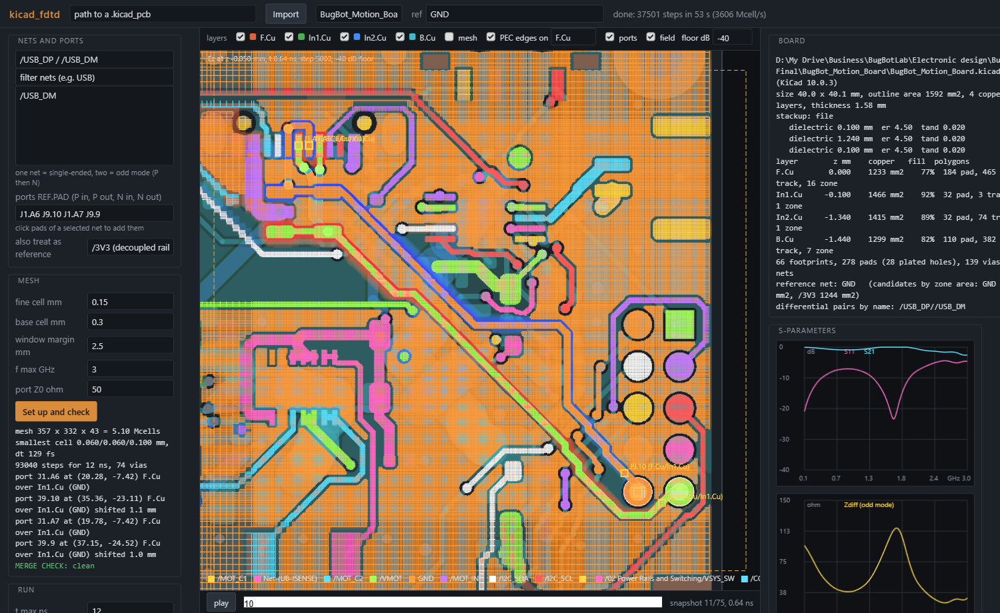
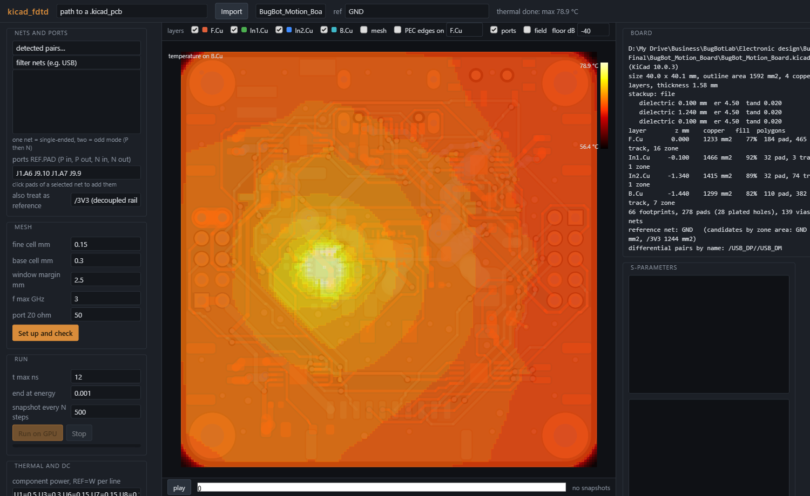
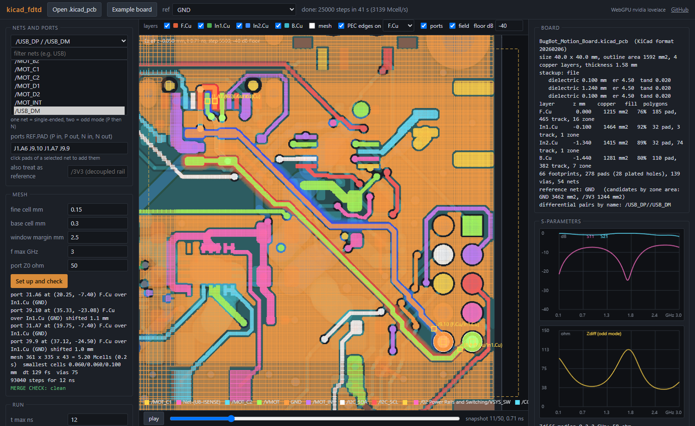
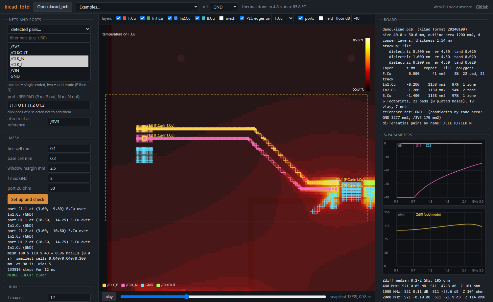
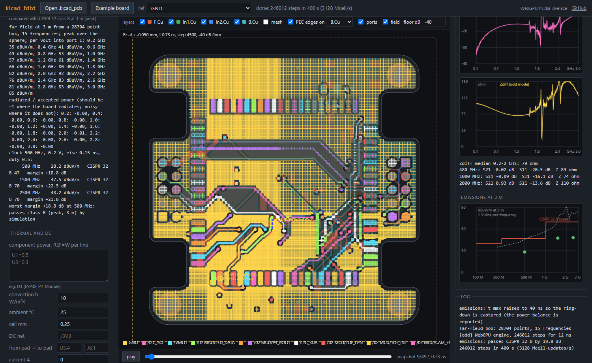

# kicad_fdtd

A GPU field solver for KiCad boards. Point it at any `.kicad_pcb`: it pulls the exact copper
(pads, tracks, zone fills, vias, outline, stackup) through KiCad's own geometry engine, meshes
the nets you care about, checks the model before it spends a second of GPU time, and gives you
S-parameters, impedance and a field view in a browser. Written in Python with NumPy and CuPy;
no openEMS, no black box.

```
kicad-fdtd stats   my_board.kicad_pcb                      # what is on the board
kicad-fdtd pair    my_board.kicad_pcb /USB_DP /USB_DM --ports J1.A6 U5.1 J1.A7 U5.3
kicad-fdtd thermal my_board.kicad_pcb --power U1=0.5 U3=0.3 --net /3V3 --from U3.4 --to J8.1 --current 1
kicad-fdtd gui                                             # everything above in a browser
```





## In the browser, no install



**https://jeromegraves.com/kicad_fdtd/** runs the whole tool on your own machine: drop a
`.kicad_pcb` on the page (nothing is uploaded), get the stats, pick nets and pads, mesh and
check, run the field solver on your GPU through WebGPU (Chrome or Edge; other browsers fall
back to a slow JavaScript engine), and solve thermal and IR drop. The browser build in
`docs/app/` is a line-for-line port of the Python package: its own `.kicad_pcb` reader
(checked against pcbnew's polygons on real boards, pad positions to the micron), the same
mesh, edge assignment and merge check, the same six kernels in WGSL, and the same
finite-volume thermal/DC solver. On the same board and mesh it returns the same Zdiff as the
Python/CuPy solver and runs at the same speed (3.2 Gcell-updates/s on an RTX 4070).
`docs/selftest.html?board=...&nets=...&ports=...` runs the pipeline headlessly;
`tests/web/*.mjs` compare the JavaScript modules with the Python results.

## Why

Every field solver hides the same three failure modes: copper assigned to the wrong
conductor on the mesh, absorbing boundaries touching the board, ports sitting on the wrong
copper. In a black box each one costs an hour of simulation before you find out. Here the
physics is a few hundred lines you can read, every mesh edge's owner is visible in the GUI,
and a merge check refuses to solve a model where two conductors touch. On an RTX 4070 a
5 Mcell board mesh runs at 3.2 Gcell-updates per second, so a USB pair at 0.1 mm resolution
takes about a minute.

## Install

```
git clone https://github.com/Jerome-Graves/kicad_fdtd
cd kicad_fdtd
python -m venv venv && venv\Scripts\activate          # or source venv/bin/activate
pip install -e .[gpu]                                 # NumPy, shapely, CuPy for CUDA 12
```

Without a CUDA GPU use `pip install -e .` and add `--cpu` to `pair`; the solver falls back to
NumPy (correct, roughly 100 times slower). KiCad 7 or later must be installed: the exporter
runs inside KiCad's bundled Python (found automatically on Windows and macOS; on Linux the
distro package puts `pcbnew` in the system Python). Set `KICAD_PYTHON` if it is somewhere else.

## Use

**Stats.** `kicad-fdtd stats board.kicad_pcb` prints size, stackup (from the file, or a
1.6 mm FR4 default with a warning), copper area and fill per layer, footprint/pad/via/net
counts, the reference net (the net with the most zone copper, usually GND) and the
differential pairs it can recognise by name. `--json` adds per-net detail.

**Pair or single net.** `kicad-fdtd pair board.kicad_pcb NET_P [NET_N] --ports REF.PAD ...`
Ports are pad names: P start, P stop, then N start, N stop. Each port is a lumped Z0
resistor with a source between the signal copper and the nearest reference copper under
it; the whole port face has to sit on the right copper on both layers or the tool says so.
Two nets are solved in odd mode (Zdiff = 2 Zodd, S11dd, S21dd), one net single-ended.
Options: `--res` fine cell (mm, default 0.1), `--base` coarse cell, `--fmax`, `--z0`,
`--ref NET` to override the reference net, `--tie NET ...` to treat other nets as reference
copper (a decoupled rail), `--setup-only` to stop after the checks, `--bench N` for speed.

**Thermal and DC.** `kicad-fdtd thermal board.kicad_pcb --power REF=W ... [--h 10] [--tamb 25] [--cell 0.25]`
solves steady-state heat conduction on a whole-board grid built from the same exact copper:
each copper layer is a thin sheet with conductivity scaled by its copper fraction per cell,
FR4 is anisotropic (0.8 W/mK in plane, 0.3 through), via barrels conduct through the planes,
component power goes into the cells under the footprint's pads, and both faces lose heat by
convection `h` to `--tamb` (edges adiabatic, no radiation, nothing above the board: a
conservative estimate). Add `--net NET --from REF.PAD --to REF.PAD --current A` for a DC
conduction solve on one net: IR drop, resistance, current density per cell, and the Joule
heat, which is added to the thermal sources. Output: a report (max temperature and where,
per-layer maxima, hottest footprints, drop and peak current density) and a JSON with the
temperature, voltage and current-density maps per copper layer.

**Examples with presets (web app).** The *Examples* menu loads a board and fills every panel:
the demo board (`docs/examples/demo.kicad_pcb`, 4 layers, a 100 Ω clock pair from a connector
to an MCU, a single-ended clock line to a header, an LDO feeding the MCU through a 3V3 pour on
In2, two heat sources) in a signal-integrity preset and an emissions preset, the microstrip
milestone, and the patch antenna. `?example=demo-pair` in the URL does the same.



**GUI.** `kicad-fdtd gui` then open http://127.0.0.1:8765. Paste a `.kicad_pcb` path and
press Import (or pick an already exported board), read the stats, pick nets (the detected
pairs are one click), click pads for ports, **Set up and check**. The view shows the mesh
window, the mesh, the PEC edge assignment per conductor on any copper layer, the port sites
and any shorts (red rings; Run stays disabled). **Run on GPU** streams progress, keeps Ez
snapshots on the plane under the first port (slider, play) and plots S11/S21 and Zin/Zdiff.
The **Thermal and DC** panel takes component powers (REF=W per line), h, ambient, cell size
and an optional DC net with source and sink pads; the result overlays temperature, current
density or DC voltage on any copper layer with a colour bar.

**Emissions (far field).** Tick *compute the far field* before *Set up*: the whole board is
meshed with an air gap around it, and during the run the tangential fields on a Huygens box
in that gap are transformed to the far field (equivalent currents, peak over a sphere, 3 m).
The result is the field per volt driven into port 1 at each frequency, the harmonics of a
trapezoid clock you specify (frequency, amplitude, rise time, duty) in dBµV/m against the
CISPR 32 class B limit, and a plot. The report also prints radiated over accepted power per
frequency: on a lossless board it must be close to 1 where the board accepts power; if it is
well below 1 the run stopped before the ring-down ended (raise t max). 

Validation: a patch
antenna example (`docs/examples/patch.kicad_pcb`) gives 1.00 to 1.06 across its resonance,
and the port bookkeeping balances the field energy in a closed box to 0.3 %
(`tests/web/check_energy.mjs`, `tests/web/check_flux.mjs`). Caveats: the source spectrum is
a clean trapezoid on one net (common-mode paths through cables and the rest of the product
are not modelled), and the limit compared is the peak-detector line, so a pass here is a
necessary condition, not a certification.

## How it works

```
kicad_fdtd/
  export.py     KiCad's Python (pcbnew) -> geometry.json: exact polygons, vias, pads, stackup
  geometry.py   model frame (y up, z from top copper), stackup defaults, reference net,
                port sites, board stats, differential pair detection
  mesh.py       rectilinear mesh: lines on the copper edges of the nets of interest,
                neighbours' edges within 0.6 mm, base grid, graded air cells; CFL step
  voxel.py      every Yee edge assigned to a conductor by an exact polygon test at the
                edge midpoint (sheets) or cylinder (vias); merge_check finds shared nodes
  solver.py     Yee FDTD on a non-uniform grid, CPML on six faces, PEC edges, lumped ports,
                energy-based end criterion; NumPy fallback
  kernels.py    six fused CuPy kernels (curl, CPML and ports in one launch each),
                port V/I read by one kernel; no host sync inside the step loop
  pair.py       setup (mesh + assignment + checks) and solve (S-parameters, Z)
  thermal.py    whole-board finite-volume grid from the same copper; steady-state heat
                conduction with convection faces; DC conduction on one net (IR drop, J,
                Joule heat); Jacobi-preconditioned CG on the GPU (cupyx) or CPU (scipy)
  cli.py        export | stats | pair | thermal | gui | test
  gui/          standard-library server + one page
tests/          test_msl.py (microstrip milestone, GPU), test_geometry.py and
                test_thermal.py (analytic checks, no GPU)
```

Field quantities are float32; V and I are recorded on the device each step and transformed
at the end. `FDTD_PROFILE=1` prints a per-section time breakdown, `FDTD_UNFUSED=1` runs the
slice-based reference path.

## Validation

| case | this solver | reference |
|---|---|---|
| 0.2 mm microstrip over 0.1 mm FR4, 50 Ω ports (`tests/test_msl.py`) | S21 −0.06 dB, S11 −18.6 dB, Zin 42 Ω | openEMS 43 Ω, 2D FD cross-section 45 Ω |
| USB pair on a 4-layer board, 0.15 mm vs 0.1 mm mesh | Zdiff 58 Ω vs 60 Ω | 2D FD cross-section 66 Ω |
| fused kernels vs slice reference vs pre-fusion code, same mesh | identical step count, S-parameters equal to 1e-6 dB | |
| copper-clad plate, 1 W, h = 10 W/m²K both faces (`tests/test_thermal.py`) | mean rise 319.6 K | lumped P / (2 h A) = 312.5 K |
| 0.2 mm × 35 µm track, 1 A over 11.4 mm | 27.7 mV, Joule = I·V | ρ L / (w t) = 27.4 mV |
| 4-layer 40 mm board, 1.4 W in six parts, natural convection | mean rise 44 K, 79 °C at the charger | P / (2 h A) = 44 K |
| browser build vs Python: USB pair, same 0.15 mm mesh | Zdiff 58 Ω, 3.2 Gcell/s (WebGPU) | Zdiff 58 Ω, 3.2 Gcell/s (CuPy) |
| browser build vs Python: thermal and DC on the same board | 79.2 °C, 7.8 mV | 78.9 °C, 7.8 mV |
| lumped port energy vs field energy, closed PEC box, patch example | equal to 0.3 % over 2.5 ns | energy conservation |
| far field: radiated vs accepted power, patch at 1.78 to 1.90 GHz, 80 ns window | 1.00 to 1.06 | 1 (lossless) |

The milestone runs in about a second on the GPU and is the regression gate for every
change to the solver.

## Limits

- Copper is perfect (PEC) and infinitely thin. Conductor and dielectric loss are on the list.
- Only the copper of the selected nets and their neighbours within 0.6 mm is meshed finely;
  the rest of the board is on the base grid. Parts (bodies, connectors) are not modelled.
- Ports need reference copper under the pad; a trace with no plane below gets no port.
- Stackups without thicknesses fall back to 1.6 mm FR4 split evenly.
- Thermal is steady state with a uniform convection coefficient and no radiation, no
  enclosure, no component bodies: it ranks hot spots and gives a conservative rise, not a
  datasheet junction temperature. Current density is per grid cell, so a narrow neck is
  averaged over the cell (use `--cell 0.1` for tracks).

## Roadmap

- Transient thermal and a component thermal-resistance model (junction to board).
- Far field in the Python package too (today it is in the browser build only).
- Conducting-sheet loss, dielectric loss.
- Whole-board mesh presets and a results archive in the GUI.

## Contributing

See [CONTRIBUTING.md](CONTRIBUTING.md). MIT licensed.
